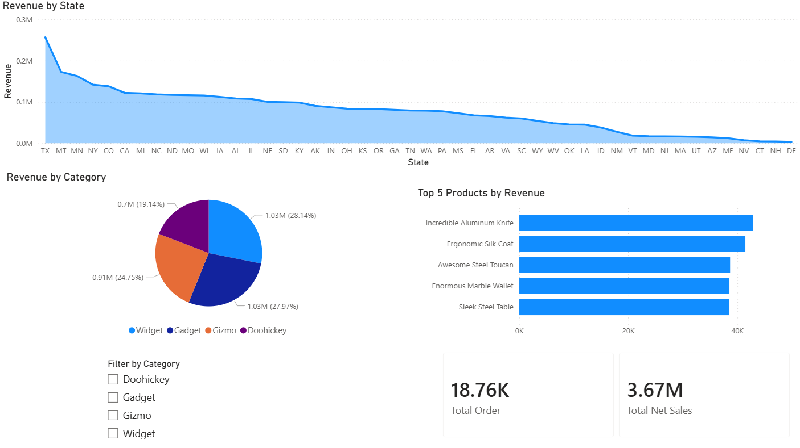

# Dashboard Preview

# Retail Sales Analysis Dashboard

This is data analysis project using SQL and Power BI.
In this project, I used sales data to analyze:

- Revenue by state
- Revenue by product category
- Top 5 products by sales
- Overall business performance

The purpose of this project is to practice SQL querying, data analysis, and dashboard building.

# Tools Used

- SQL
- Google BigQuery
- Power BI
- VS Code

# SQL Queries

## Revenue by Category

Analyze total sales generated by each product category.

## Top 5 Products by Revenue

Find the products with the highest total sales.

## Revenue by State

Compare sales performance across different states.

## Key Insights

- Texas had the highest revenue among all states.
- Widget was the top-performing category.
- Total net sales reached around 3.67M.
- The dataset contains around 18.7K total orders.
- The top 5 products generated over 38K revenue each.

# What I Learned

Through this project, I practiced:

- Writing SQL queries
- Using GROUP BY and aggregation functions
- Cleaning and organizing project files
- Building dashboards in Power BI
- Turning raw data into business insights
